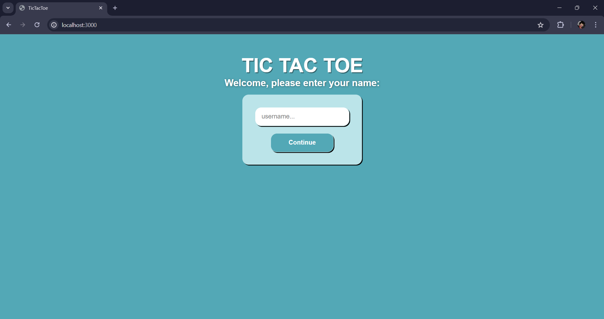
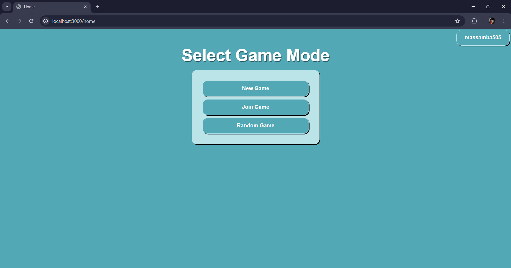
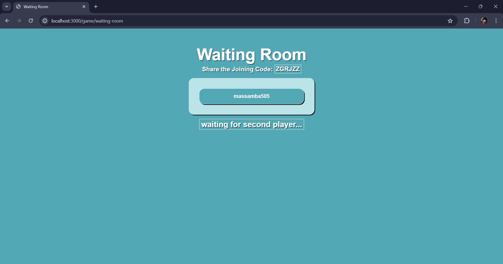
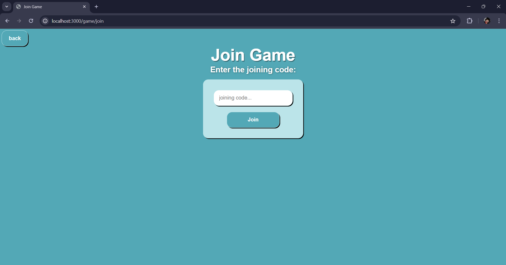
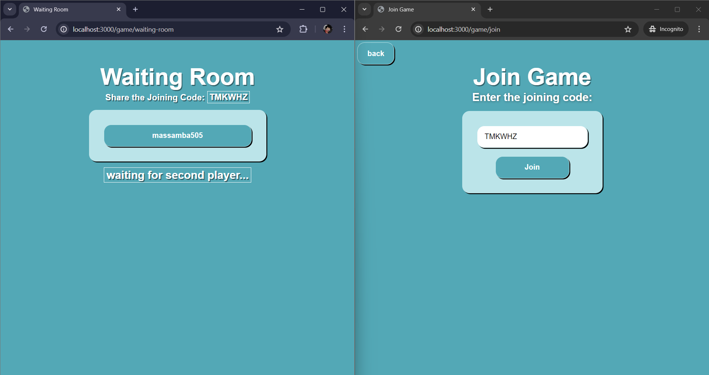
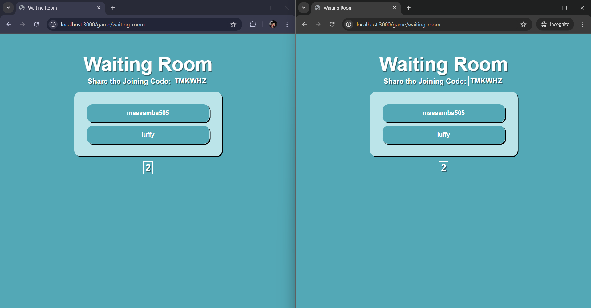
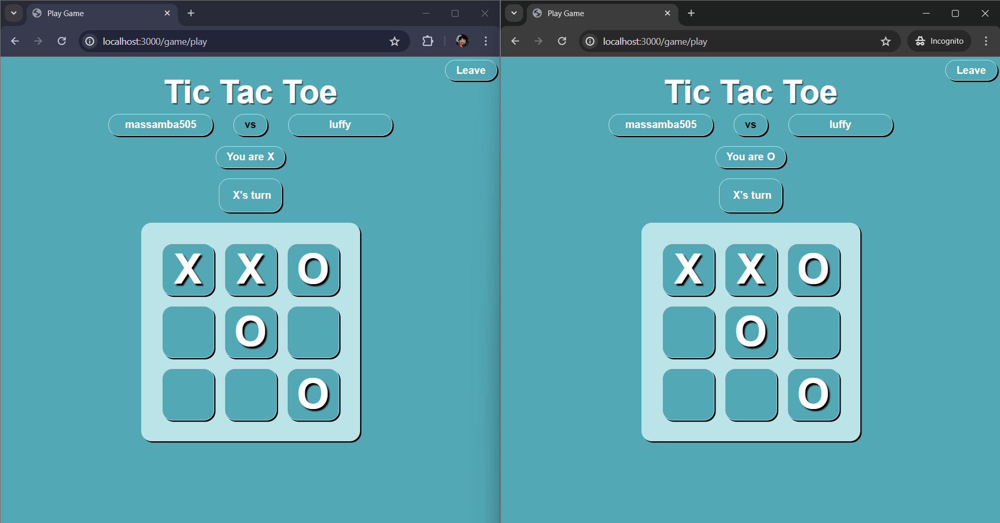
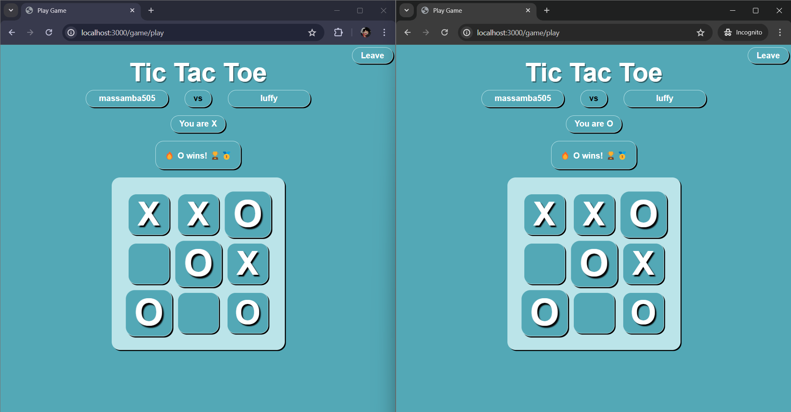

# Multiplayer Tic-Tac-Toe

A real-time multiplayer Tic-Tac-Toe game built with Node.js, Express, and Socket.IO. Players can create or join game rooms, and the game updates in real-time as players make their moves.

## Gameplay Demo
<div style="display: flex; flex-wap: wrap; flex-direction: column">
    
    
    
    
    
    
    
    
</div>

## Features

- Real-time gameplay with Socket.IO
- Create and join game rooms
- Automatic player turn management
- Game result detection (win, lose, draw)

## Prerequisites

- Node.js and npm installed on your machine

## Getting Started

### Installation

1. Clone the repository
    ```sh
   git clone https://github.com/Massamba505/Multiplayer-Tic-Tac-Toe.git
   cd Multiplayer-Tic-Tac-Toe
    ```
2. Install dependencies
    ```sh
    npm install
    ```
3. Start the development server
    ```sh
    npm start
    ```
    
## How to Play

1. **Create Username**: Enter your username then click "Continue".

1. **Create a New Game**: Click on "New Game" to start a new game and share the game code with your friend.

2. **Join a Game**: Enter the game code provided by your friend and click "Join" to join their game.

3. **Gameplay**: Alternate turns with your opponent by clicking on the grid to place your mark (X or O). The game updates in real-time.

4. **Winning**: The game automatically detects when a player wins or if it's a draw and displays the result.

## Technologies Used

- **Node.js**: Server-side JavaScript runtime environment.
- **Express**: Web framework for Node.js.
- **Socket.IO**: Library for real-time web applications using WebSockets.

## Deployment

This project incorporates Continuous Integration and Continuous Deployment (CI-CD) principles. I am using Azure and GitHub for my deployment pipeline. The deployment process is as follows:

1. **GitHub Actions**
- I used GitHub Actions for Continuous Integration. Each push to the repository triggers a workflow that runs our test suite to ensure that all changes pass the tests.

2. **Azure Pipeline**
- The application is automatically deployed to Azure. The pipeline configuration in GitHub Actions handles the build and deployment process, ensuring that the latest version of the application is always available on our Azure server.

## Website

You can access this Multiplayer Tic Tac Toe at: [https://multiplayer-tic-tac-toe.azurewebsites.net](https://multiplayer-tic-tac-toe.azurewebsites.net)
